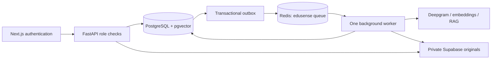

# EduSense AI Backend

A lecture-processing backend with a durable PostgreSQL job ledger, an arq/Redis worker, private object storage and authenticated student/admin APIs. The existing transcription, topic validation and student response schemas remain in place.



## Setup

Install Python 3.11 and FFmpeg, copy `.env.example` to `.env`, and configure the provider credentials. Native Redis TLS connections use `rediss://`, not an HTTP REST endpoint. For an isolated local database, `docker compose up --build` starts PostgreSQL/pgvector, Redis, migrations, API and worker. It overrides the database and storage settings for local development; provider calls still require your configured credentials.

For an existing database, inspect `alembic current` and the actual schema before `alembic upgrade head`. The additive revisions `20260930_0006` and `20260930_0007` introduce leases/outbox, submission keys and relational indexes. Do not stamp a legacy database to the latest revision: that skips required changes. A database formerly created through `create_all` must first be compared against the historical revision it actually matches.

```bash
pip install -r requirements.dev.txt
alembic upgrade head
uvicorn app.main:app --host 0.0.0.0 --port 8000 --workers 1
# Separate process:
arq app.workers.queue.WorkerSettings
```

Local transformer embeddings remain optional (`requirements.local-ai.txt`). Production embeddings request `VECTOR_SIZE` dimensions and reject incompatible output. Current historical schema uses 384 dimensions; changing that requires a separate reviewed data migration.

## API and authorization

The Next.js frontend verifies Supabase identity and chooses roles from trusted application metadata or `ADMIN_ALLOWED_EMAILS`, never editable user metadata. It signs short-lived backend claims using the shared `INTERNAL_API_KEY`. Direct backend requests need the signed bearer token. Admin routes return 403 for student claims. Existing internal student routes remain compatible with trusted server-to-server headers. Session cookies expire after eight hours; backend tokens after five minutes.

- `POST /api/v1/upload`: multipart lecture/reference files. Optional `Idempotency-Key` (1–128 characters). Matching repeated submissions return the same lecture/job; conflicting scoped key reuse returns 409. The fingerprint includes authorized course metadata, ordered source/reference hashes and processing version. Combined upload bound: 250 MB.
- `GET /api/v1/processing?limit=50&offset=0&status=completed&course=...`: existing list response, bounded to 100 items per page. Detail, rebuild and resume routes retain their existing fields.
- Existing lecture editing, fact-checking, knowledge, analytics and student APIs remain available behind role checks.
- `/health`: process liveness. `/ready`: database/outbox, Redis, worker heartbeat, authentication and durable-storage configuration. `/metrics`: request counts, errors and cumulative latency histogram. Application HTTP logs are JSON with sanitized request IDs and no request bodies.

## Durable processing and failure handling

A transaction inserts the lecture, job and outbox together. After commit the API enqueues immediately as a fast path; reconciliation repeatedly dispatches committed work, so an enqueue outage cannot lose a committed job. PostgreSQL owns state; Redis is a disposable dispatch mechanism. Queue names isolate EduSense from Deepfake when sharing one Redis database.

The public job states remain `queued/running/completed/failed`; transcription and validation remain stages. Workers claim a 90-second lease (`WORKER_LEASE_SECONDS`) and renew every sixth of it. Expired or legacy unleased jobs are recovered. Every pipeline progress commit locks and checks the lease token before flushing, preventing a replaced worker from publishing its changes. Transcript/topic/knowledge stages replace their previous rows transactionally. Transcription is checkpointed in job details and reused after interruption. Network/timeouts, 429 and provider 5xx errors receive at most three execution attempts with 5/20-second exponential delays; deterministic errors become durable failures. Manual resume starts a fresh attempt budget.

Supabase buckets must be private. Originals and references remain durable; disposable local download copies are removed after processing and can be downloaded by a worker on another host. Local storage remains a development adapter. Production schema bootstrap should be disabled (`AUTO_BOOTSTRAP_SCHEMA=false`).

Q&A cache keys include identity, lecture scope, approved-content digest, model settings and cache version. Approval/content changes invalidate the key, cache hits still record the chat exchange, and Redis cache failure falls through to the original answer path. Cache TTL is five minutes.

HNSW is deliberately gated. `python scripts/validate_vector_index.py` compares cosine exact search with HNSW on copied vectors, including lecture filters. It needs at least 500 existing vectors and 50 perturbed queries. Only `--enable`, after every recall-at-10 check reaches 0.99, creates the live index concurrently. No index is claimed as enabled until its report confirms that.

## Verification and deployment

`python -m pytest tests -q` runs lightweight role, expiry and fingerprint tests. Set an explicit isolated `SDE_TEST_DATABASE_URL` ending in `_test` to run the real PostgreSQL/Redis recovery suite. It exercises enqueue outages, ten task cancellations after a persisted checkpoint, stale leases, duplicate delivery and fencing; provider processing is deterministic in that suite. `scripts/chaos_worker_kill.py` separately hard-kills a real worker process.

GitHub Actions creates PostgreSQL/pgvector and Redis services, checks additive migration rollback/reapplication on the disposable database, runs tests and builds Docker. Provider/model tests and benchmarks remain separate from these checks. `scripts/supervise.py` lets a single web container supervise API and worker; Docker Compose keeps them separate.

Deploy a verified backend revision and checked additive migrations, then the matching Next.js frontend. New authentication requires a coordinated frontend rollout; existing unsigned admin clients will be rejected. Preserve the previous backend/frontend commits and database backup for rollback. A configured `RENDER_DEPLOY_HOOK` is triggered only after CI passes. Provider-side automatic deployment must also be gated before enabling main-branch rollout.

Free hosting sleeps and has quotas. Recovery is implemented; uninterrupted uptime is not promised. Current Hugging Face CPU/Docker creation requires a paid plan, so it is not an assumed free fallback. No paid resources are provisioned.

## Evidence status

| Evidence | Baseline | Upgrade | Status |
|---|---|---|---|
| Dispatch | in-process background tasks | PostgreSQL ledger + transactional outbox + arq worker; immediate enqueue with reconcile fallback | implemented |
| Authorization | admin APIs open, editable role metadata | signed short-lived backend claims, trusted metadata/allowlist | implemented |
| Test suite (real PostgreSQL/pgvector + Redis) | none | 8 pass: roles, expiry, fingerprints, enqueue outage, 10 cancellations, stale lease, duplicate delivery, lease fencing | measured locally |
| Hard worker kills | not tested | 10 real process kills after persisted checkpoint: 10/10 jobs completed, 0 duplicate rows, 0 repeated transcription calls ([artifact](artifacts/chaos-worker-kill.json)) | measured locally, fixture provider |
| Migrations | — | additive upgrade, downgrade, upgrade round-trip on pgvector/pg16 | measured locally |
| HNSW gate | exact scan only | recall@10 = 1.0 (global and lecture-scoped) on 5,000 synthetic 384-d vectors; 3.9 ms vs 5.6 ms median ([artifact](artifacts/hnsw-synthetic.json)) | measured locally, synthetic; not yet run on live corpus |
| Real transcription/RAG throughput, p95, cache hit | not measured | not measured | — |
| Live demo | existing Render deployment | not yet redeployed | pending Redis + deploy |

Reproduce the kill test (isolated `*_test` database, disposable Redis): `WORKER_LEASE_SECONDS=6 python scripts/chaos_worker_kill.py --jobs 10 --kills 10`. Only provider calls are fixtures; leases, heartbeats, outbox, checkpoints and stage writes are production code.

Do not turn unmeasured rows into resume numbers. This repository upgrade does not change resume or portfolio copy.
